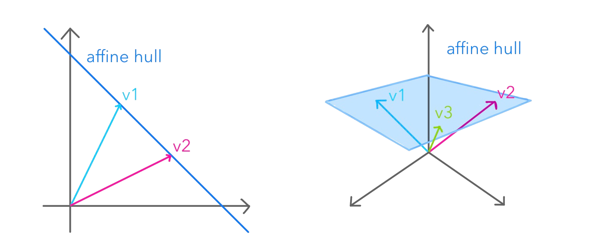
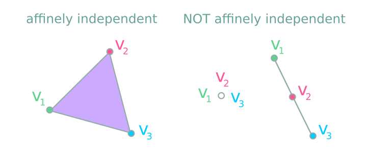
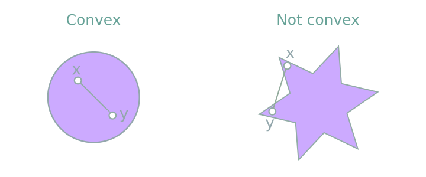
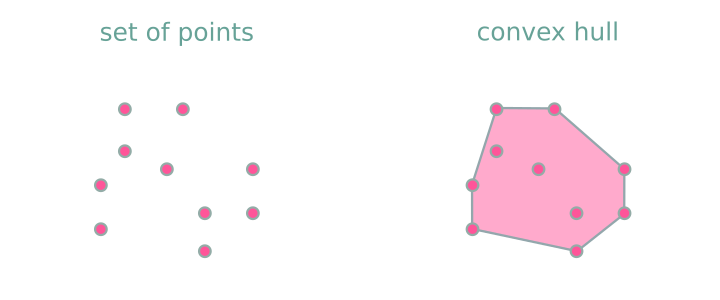
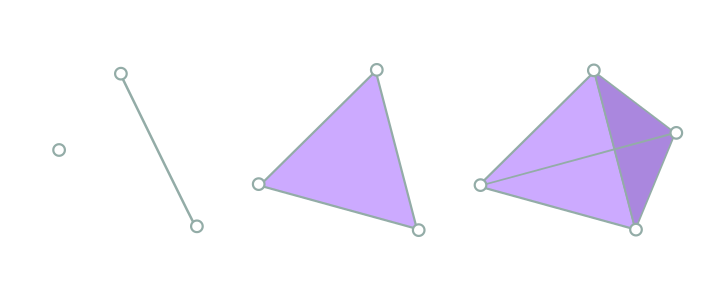
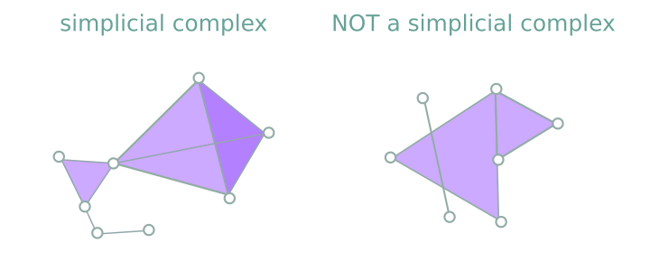

#  Simplicial Complexes 

Simplicial complexes are a bunch of simplices put together. They are like lego constructions, where each lego piece is a simplex. Intuitively, We can think of a simplex as a generalized version of a triangle. And just like legos, there are certain ways to put the simplices together so they can form a simplicial complex.

To better understand simplices and simplicial complexes, we need some geometric concepts beforehand.

##  Fundamentals 

* **Affine combination and affine hull:** we can think of an affine hull as a shifted vector subspace. More formally, let $$x_0,\dots,x_k\in\mathbb{R}^n$$. A point $$x\in\mathbb{R}^n$$ is an *affine combination* of the $$x_i$$'s if it can be written as $$x=\overset{k}{\underset{i=0}{\sum}}\lambda_ix_i$$, where $$\overset{k}{\underset{i=0}{\sum}}\lambda_i=1$$. The set of all affine combinations of $$x_0,\dots,x_k\in\mathbb{R}^n$$ is known as their *affine hull*.

***Figure 1:*** *Visualization of an affine hull. It looks like a translation of a vector subspace.*

* **Affinely independent points:** a set of $$k$$ points is affinely independent if they do not lie in the same vectorial subspace of $$k-2, k-1, \dots, 0$$ dimensions. For example, $$3$$ points are not affinely independent if they are either the same point ($$0$$-dimensional) or lie in the same line ($$1$$-dimensional).

***Figure 2:*** *NOT affinely independent  and affinely independent points in the plane.*

In formal language, $$x_0,\dots,x_k\in\mathbb{R}^n$$ are affinely independent if any two affine combinations $$x=\overset{k}{\underset{i=0}{\sum}}\lambda_ix_i$$ and $$y=\overset{k}{\underset{i=0}{\sum}}\gamma_ix_i$$ are the same if and only if $$\gamma_i=\lambda_i$$ for every i. That means that every vector in the affine hull of $$x_0,\dots,x_k$$ is a unique affine combination of them.

Additionally, $$x_0,\dots,x_k\in\mathbb{R}^n$$ are affinely independent iff the $k$ vectors $$x_i-x_0$$, for $$1\leq{i}\leq{k}$$ are linearly independent. This means that in $$\mathbb{R}^n$$ we can have at most $$n+1$$ affinely independent points.

* **Convex set:** a set $$X$$ is convex if the segment that connects every two points in $$X$$, is part of $$X$$. This means, $$X$$ is *convex* if $$\lambda{x}+(1-\lambda)y\in{X}$$, for all $$x,y\in{X}$$ and $$\lambda\in[0,1]$$ 

***Figure 3:*** *Convex and non-convex sets.*

* **Convex combination and convex hull:** The convex hull of a set $$X$$ is the smallest convex set that contains $$X$$. More formally, a *convex combination* is an affine combination where all the $$\lambda_i$$'s are non-negative, and the convex hull is the set of convex combinations. 

<!-- For one point would be the same point, for two points would be them and the line that joins them, For three points would be them, the line that joins them and the space in between etc. -->

***Figure 4:*** *Convex hull of points in the plane.*

<!--  -->

* **Simplex:** A $$k-$$simplex is the convex hull of $$k+1$$ affinely independent points. It looks like a generalized version of a triangle. We will denote the $$k-$$simplex created by $$x_0,\dots,x_{k+1}$$ by $$\Delta[x_0,\dots,x_{k+1}]$$. 

***Figure 5:*** *From left to right: 0-simplex or vertex, 1-simplex or edge, 2-simplex or triangle, 3-simplex or tetrahedron.*

Every simplex that we can form with a non-empty subset of $$\{x_0,\dots,x_{k+1}\}$$ will be called a *face* of $$\Delta[x_0,\dots,x_{k+1}]$$. Since a set of $$k+1$$ points has $$2^{k+1}$$ subsets (including the empty set), then a $$k-$$ simplex has $$2^{k+1}-1$$ faces including itself.  

##  What are simplicial complexes? 

A simplicial complex is a bunch of simplices that can be either disjoint or joint by an entire face with some other simplices. 

***Figure 6:*** *How simplicial complexes are made from simplices.*

To be more specific, a *simplicial complex* $$K$$ is a finite collection of simplices such that:

* if $$\sigma\in{K}$$ and $$\tau$$ is a face of $$\sigma$$, then $$\tau\in{K}$$.
* if $$\sigma,\sigma'\in{K}$$, then either $$\sigma\cap\sigma'=\emptyset$$ or $$\sigma\cap\sigma'$$ is a face of $$K$$.

And its dimension will be the highest dimension of its simplices.

So far, I tried to give an intuition of simplicial complexes and the mathematical definition to avoid ambiguities. Now that you have this intuition, I would write very short about the abstract version.

### **Abstract simplicial complexes**

An *abstract simplicial complex* is a set of points $$V$$, that we will call *vertices*, and a set $$R$$ of non-empty subsets of $$V$$ that has the following properties:
1. $$\{v\}\in{R}$$, for all $$v\in{V}$$
2. If $$\sigma\in{R}$$ and $$\tau\subseteq\sigma$$, with $$\tau\neq\emptyset$$, then $$\tau\in{R}$$

Additionally:
* The elements of $$R$$ are called *simplices*, and if $$\sigma\in{R}$$ with $$\#\sigma=n+1$$, we say that $$\sigma$$ is a $$n-$$*simplex*.
* If $$\sigma\in{R}$$ and $$\tau\subseteq\sigma$$, then we say that $$\tau$$ is a *face* of $$\sigma$$, and $$\sigma$$ is a *coface* of $$\tau$$.
* We will say that a simplicial complex $$K=(V,R)$$ is *finite* if the set of vertices $$V$$ is *finite*, and it will be *locally finite* if every vertex is an element of at the most a finite number of simplices.

---
References:

1. [Rieck, Bastian (2020). *A Primer in Topological Data Analysis*.](https://youtu.be/gVq_xXnwV-4)
2. [Edelsbrunner, Herbert and Harer, John (2010). *Computational Topology - an Introduction*. American Mathematical Society. pp. 62-63. ISBN-978-0-8218-4925-5.](https://www.maths.ed.ac.uk/~v1ranick/papers/edelcomp.pdf)
3. Gritzmann, Peter (2013). *Grundlagen der Mathematischen Optimierung*. Springer. ISBN-978-3-8348-2011-2.
4. [Guzmán Sáenz, Aldo. *Análisis topológico de datos: teoría y práctica.*](https://gta.cimat.mx/sites/ATD/files/notashomologiapersistente.pdf)
5. [PBS Infinite Series (2017). *Simplicial Complexes - Your Brain as Math Part 1 Infinite Series.*](https://youtu.be/rlI1KOo1gp4)

---

<!-- Imagine you have a set of points in the plane, like this:

Does the shape of data provide any valuable insights? -->